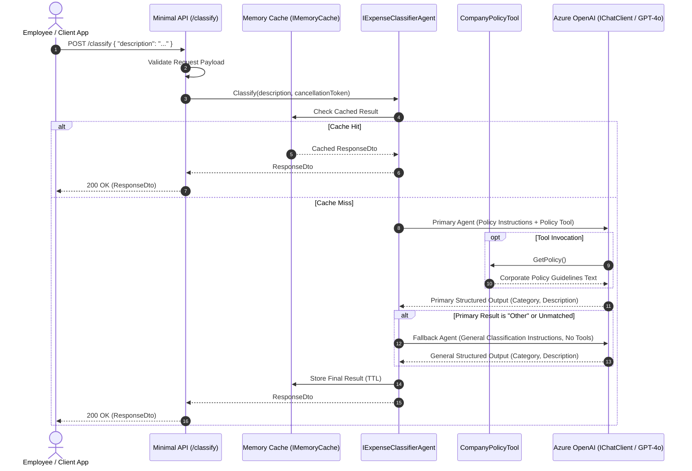

# Enterprise Expense Classifier API
## Hands-On Technical Assessment & Candidate Guide

---

## 1. Executive Summary & Assessment Overview

Welcome to the **Enterprise Expense Classifier** hands-on technical assessment.

This repository contains a .NET 10 web service designed to automate corporate expense classification using **Agentic AI** and **ASP.NET Core Minimal APIs**. The service exposes an endpoint, `POST /classify`, which receives an employee's free-form expense description (e.g., *"Bolt ride from Murtala Muhammed Airport to Victoria Island"*, *"Client lunch at Bukka Hut Lekki"*, *"Monthly MTN 5G Broadband data subscription"*), performs intelligent categorization via a two-stage agentic workflow, and returns a structured classification response.

### Assessment Objective
This repository is a **starter skeleton**. The interface contract `IExpenseClassifierAgent` is defined, but its concrete implementation (`ExpenseClassifierAgent`) has been left unimplemented (`NotImplementedException`). Additionally, several critical Dependency Injection (DI) registrations are missing or require review, and caching/validation layers must be designed and implemented by you.

**Your mission as a candidate:**
1. **Complete Dependency Injection**: Review `Program.cs`, wire up all missing services, and ensure the DI container is properly configured for the application.
2. **Implement Two-Stage Agentic Classification Pipeline**:
   * **Stage 1 (Policy-Driven Agent with Tool Calling)**: Classify expenses using corporate guidelines retrieved via `CompanyPolicyTool`.
   * **Stage 2 (Fallback General Classification Agent without Tools)**: If the primary agent cannot find a policy match or categorizes the expense as `"Other"`, invoke a secondary general classification agent (without tool calling) to perform a broader classification.
3. **Implement High-Performance Caching**: Integrate an in-memory cache-aside layer (`IMemoryCache`) with key normalization, expiration policies, and protection against caching failed/invalid results.
4. **Harden the API**: Add input validation, cancellation token propagation, structured error handling (RFC 7807 `ProblemDetails`), and eliminate compiler warnings.

---

## 2. Business Domain & System Workflow

### 2.1 Domain Context
In enterprise operations, employees submit expense claims spanning local transportation, client entertainment, regional travel lodging, and branch utility overheads. Expenses matching internal company policies are categorized into approved GL buckets; unrecognized items fall back to a general classifier.

### 2.2 Classification Rules & Workflow
1. **Primary Policy Evaluation**:
   * Official company policy categories include: `Transportation`, `Food`, `Accommodation`, `Utilities`, and `Other`.
   * The primary agent must consult `CompanyPolicyTool` via function/tool calling to retrieve rules (covering rideshares like Bolt/Uber, local dining, hotels, and electricity/internet utility bills).
2. **Fallback General Classification**:
   * If the primary agent classifies the expense as `"Other"` (or returns an unrecognized/empty match), the system must fallback to a **secondary general classification agent**.
   * The secondary agent runs **without tool calling** and performs general categorization on the description.

### 2.3 System Workflow Diagram



---

## 3. Architecture & Technology Stack

| Layer / Concern | Technology / Library | Role in Application |
|---|---|---|
| **Runtime & SDK** | .NET 10 (`net10.0`, C# 13/14) | High-performance runtime with modern C# features and nullable reference types enabled. |
| **Web Framework** | ASP.NET Core Minimal APIs | Lightweight HTTP endpoint routing and request handling. |
| **AI Abstractions** | `Microsoft.Extensions.AI` | Unified AI client abstractions (`IChatClient`, `AIFunctionFactory`). |
| **Agent Framework** | `Microsoft.Agents.AI` | Agentic orchestration and tool-augmented generation pipeline. |
| **AI Client SDK** | `Azure.AI.OpenAI` | Official client establishing connection to Azure OpenAI models. |
| **Caching** | `Microsoft.Extensions.Caching.Memory` | In-process cache-aside store for LLM responses. |
| **Dependency Injection** | `Microsoft.Extensions.DependencyInjection` | IoC container for service registration and lifetime management. |

---

## 4. Current Codebase Structure

```
ExpenseClassifier/
│
├── ExpenseClassifier.slnx               # Solution definition file
│
└── ExpenseClassifier/
    ├── ExpenseClassifier.csproj        # Project configuration & package references
    ├── Program.cs                      # Entry point, DI container setup, and /classify route
    ├── appsettings.json                # Configuration settings (Azure OpenAI endpoints)
    ├── appsettings.Development.json    # Development logging configurations
    │
    ├── Models/
    │   └── RequestDto.cs               # Request and Response transfer models
    │
    ├── Services/
    │   └── ExpenseClassifierAgent.cs   # IExpenseClassifierAgent interface & stubbed implementation
    │
    └── Tools/
        └── CompanyPolicyTool.cs        # Tool function supplying corporate policy rules
```

---

## 5. Candidate Assessment Tasks

You are expected to complete the following four tasks during this evaluation:

### Task 1: Complete Dependency Injection & Service Setup
* Review [Program.cs](file:///c:/Dev/Learning/Interview-Questions/HandsOn/ExpenseClassifier/ExpenseClassifier/Program.cs).
* Identify and configure all required services in the DI container (`IServiceCollection`) to ensure the application starts and functions seamlessly.
* Ensure all dependencies are appropriately registered, structured, and injected across the service pipeline.

### Task 2: Implement Multi-Stage `IExpenseClassifierAgent`
* Implement the classification logic in [ExpenseClassifierAgent.cs](file:///c:/Dev/Learning/Interview-Questions/HandsOn/ExpenseClassifier/ExpenseClassifier/Services/ExpenseClassifierAgent.cs) adhering to `IExpenseClassifierAgent`.
* **Primary Agent (Policy-Driven with Tool Calling)**:
  * Configure system instructions to classify expenses according to internal company policy.
  * Integrate `CompanyPolicyTool` via tool/function calling so the model queries policy guidelines when necessary.
* **Fallback Agent (General Classification without Tools)**:
  * If the primary agent categorizes an expense as `"Other"` or fails to match policy rules, trigger a secondary agent configured for general classification **without** tool calling.
* **Structured Output**: Ensure both stages return strictly structured data matching `ResponseDto` (`Category`, `ExpenseDescription`).
* **Performance Consideration**: Avoid expensive per-request reflection, recompilation, or redundant object allocations.

### Task 3: Implement High-Performance Cache-Aside
* Check `IMemoryCache` prior to initiating any LLM invocation.
* **Key Normalization**: Ensure cache keys are properly sanitized (e.g., trimming whitespace and handling case insensitivity) so that variations like `" Bolt ride to Victoria Island "` and `"bolt ride to victoria island"` yield cache hits.
* **Safe Storage**: Avoid caching `null`, empty, or failed classification results.
* Apply an appropriate expiration policy (e.g., sliding or absolute TTL).

### Task 4: API Robustness, Validation & Error Handling
* Validate incoming request payloads (reject `null`, empty strings, whitespace, or excessively large inputs).
* Ensure proper `CancellationToken` propagation throughout all async operations.
* Implement structured error handling returning RFC 7807 `ProblemDetails` for invalid inputs, missing configuration, or upstream AI service outages.
* Modernize models and data contracts where applicable (e.g., modern C# record types, immutability, nullable annotations).
* Eliminate all compiler warnings under `<Nullable>enable</Nullable>`.

---

## 6. Architectural Challenges & Key Considerations

As you architect your solution, consider the following technical aspects:

1. **Multi-Agent Flow & Fallback Orchestration**:
   * Ensure the transition from the primary policy agent to the secondary general agent is seamless, safe against null responses, and handles upstream errors gracefully.
2. **Object Lifecycle & Allocation Efficiency**:
   * Dynamically parsing function schemas, compiling reflection metadata, or rebuilding agents on every single incoming HTTP request introduces significant latency and memory pressure. Strive for reusable, thread-safe instances.
3. **Resilience & Fault Tolerance**:
   * External AI APIs can experience rate-limiting (HTTP 429), timeouts, or transient network failures. Consider how your service degrades gracefully and communicates errors to clients.
4. **Configuration & Enterprise Security**:
   * Evaluate how endpoints and secrets are loaded from configuration and how support for passwordless authentication (`Azure.Identity` / `DefaultAzureCredential`) could be supported alongside API keys.

---

## 7. Candidate Evaluation & Grading Rubric

| Dimension | Junior / Associate (1-2) | Mid-Level (3) | Senior Engineer (4) | Staff / Lead Architect (5) |
|---|---|---|---|---|
| **DI & Architecture Setup** | Incomplete service registrations; application fails to resolve dependencies. | Registers all missing services cleanly with working configuration. | Evaluates service lifetimes and dependencies thoughtfully; avoids captive dependencies and redundant allocations. | Elegant DI architecture, strongly typed options pattern, support for Managed Identity, and extensible module structure. |
| **Multi-Stage AI Agent Architecture** | Basic prompt; re-creates agent per request; misses fallback routing. | Implements both primary (tool-calling) and fallback (no-tool) agent pipelines with structured output. | Pre-builds reusable agents; robust fallback orchestration; null-safe response handling. | Production-grade prompt architecture, telemetry hooks, token usage tracking, and resilience policies. |
| **Caching & Performance** | Naive cache lookup using raw string keys; may cache failed states. | Implements cache-aside with TTL. | Normalizes cache keys; prevents null caching; considers cache size limits. | Thread-safe caching, cache stampede prevention, zero-allocation memory awareness. |
| **API Quality & C# 13/14** | Code compiles with warnings; uses mutable classes and verbose syntax. | Zero compiler warnings; clean nullable reference handling. | Modern C# idioms (records, pattern matching, primary constructors, clean error handling). | Flawless API contracts, RFC 7807 problem details, endpoint filters, and OpenAPI documentation. |

---

## 8. Sample Requests & Expected Outputs

Below are sample requests demonstrating expected classifications across policy matches and fallback scenarios:

### Example 1: Transportation (Policy Match via Bolt/Uber)
**Request:**
```http
POST /classify
Content-Type: application/json

{
  "description": "Bolt ride from Murtala Muhammed Airport to Victoria Island office"
}
```
**Expected Response:**
```json
{
  "category": "Transportation",
  "expenseDescription": "Bolt ride from Murtala Muhammed Airport to Victoria Island office"
}
```

---

### Example 2: Food (Policy Match via Restaurant Dining)
**Request:**
```http
POST /classify
Content-Type: application/json

{
  "description": "Client dinner meeting at Terra Kulture Restaurant Victoria Island Lagos"
}
```
**Expected Response:**
```json
{
  "category": "Food",
  "expenseDescription": "Client dinner meeting at Terra Kulture Restaurant Victoria Island Lagos"
}
```

---

### Example 3: Accommodation (Policy Match via Hotel Stay)
**Request:**
```http
POST /classify
Content-Type: application/json

{
  "description": "2 nights hotel accommodation at Eko Hotel and Suites Lagos for annual strategy retreat"
}
```
**Expected Response:**
```json
{
  "category": "Accommodation",
  "expenseDescription": "2 nights hotel accommodation at Eko Hotel and Suites Lagos for annual strategy retreat"
}
```

---

### Example 4: Utilities (Policy Match via Electricity / Internet Bills)
**Request:**
```http
POST /classify
Content-Type: application/json

{
  "description": "Ikeja Electric (IKEDC) prepaid meter token recharge for Ikeja branch office"
}
```
**Expected Response:**
```json
{
  "category": "Utilities",
  "expenseDescription": "Ikeja Electric (IKEDC) prepaid meter token recharge for Ikeja branch office"
}
```

---

### Example 5: Utilities (Policy Match via Internet Service Provider)
**Request:**
```http
POST /classify
Content-Type: application/json

{
  "description": "Monthly MTN 5G Broadband router data subscription for engineering team"
}
```
**Expected Response:**
```json
{
  "category": "Utilities",
  "expenseDescription": "Monthly MTN 5G Broadband router data subscription for engineering team"
}
```

---

### Example 6: Fallback General Classification (Unmatched by Policy Tool)
*Note: This expense does not match the strict company policy categories in `CompanyPolicyTool`, causing the primary agent to evaluate it as `"Other"` and trigger the secondary general classification agent.*

**Request:**
```http
POST /classify
Content-Type: application/json

{
  "description": "Annual JetBrains Rider IDE team license renewal for software engineers"
}
```
**Expected Response:**
```json
{
  "category": "Software Subscriptions",
  "expenseDescription": "Annual JetBrains Rider IDE team license renewal for software engineers"
}
```

---

## 9. Submission Guidelines

1. **GitHub Repository**: Push your complete solution and implementation to your personal GitHub repository (either public or private with invited access).
2. **Submission Channel**: Send an email back to the recruiting/engineering team containing the direct URL link to your GitHub repository.
3. **Clean Code & Build**: Ensure your solution builds cleanly with zero errors and zero warnings (`dotnet build`).
4. **Commit History**: Commit incrementally with clear, descriptive commit messages demonstrating your step-by-step engineering thought process.
5. **Summary Notes**: Include a brief section or `NOTES.md` file in your repository detailing:
   - Your architectural approach to implementing `ExpenseClassifierAgent` (both primary tool-calling and fallback stages) and your DI decisions.
   - How you handled caching, error scenarios, and performance optimization.
   - Any future enhancements you would propose for an enterprise production rollout.
